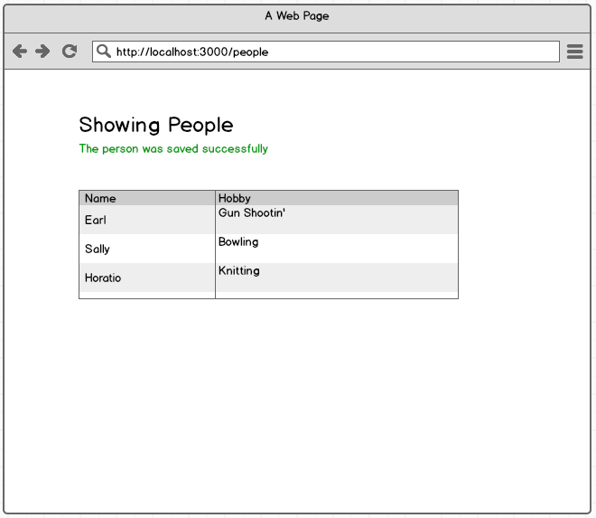
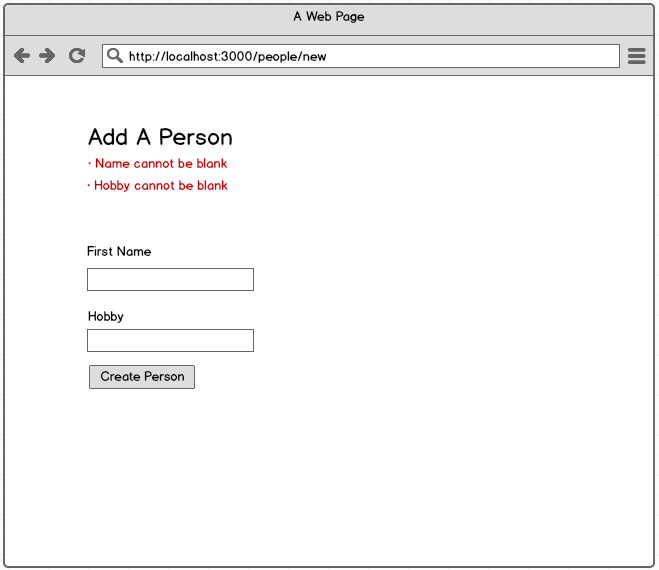

# Express Validations

[Slides](https://slides.com/akyunaakish/express-validations)

## Objectives

1. Generate error messages based on whether or not data was supplied in a form submit, checking `req.body` to do so.
1. Prevent duplicate data from being added into the database. Generate error messages if certain data submitted through a form already exists in the database.

## Setup

### Getting Started

1. Fork/Clone this repo
1. Read through this document to get familiar with the concepts
1. Generate a new express app, making sure to install `pg` and `knex`: `npm install --save pg knex`
1. Install the dependencies

### Database Setup

1. Initialize `knex` within the root directory:

  ```sh
  $ knex init
  ```

1. Update the code in *knexfile.js* with:

  ```javascript
  module.exports = {
    development: {
      client: 'postgresql',
      connection: 'postgresql://localhost/knex_people',
      migrations: {
        directory: __dirname + '/src/server/db/migrations'
      },
    }
  };
  ```

1. Create a new database:

  ```sh
  $ createdb knex_people
  ```

1. Create a new migrations file:

  ```sh
  $ knex migrate:make create_people
  ```

1. In your text editor, open up the file you generated within the migrations folder and create this table schema:

  ```javascript
  exports.up = (knex, Promise) => {
    return knex.schema.createTable('people', (table) => {
      table.increments();
      table.string('username').unique().notNullable();
      table.string('hobby')notNullable();
      table.timestamp('created_at').defaultTo(knex.fn.now());
    });
  };

  exports.down = (knex, Promise) => {
    return knex.schema.dropTable('people');
  };
  ```

1. Apply the migration:

  ```sh
  $ knex migrate:latest
  ```

  Did this work? Find out!

## User Stories

### Homepage

```
When a user goes to the '/' route
they should be redirected to the '/people' GET route
all of the people from the database should be displayed on the people.html page in a table
```

### Users can create people

```
When a user goes to the site's homepage
And clicks on the anchor tag "Add a Person"
The user will be taken to a page with a create person form
When the user fills out the form
And clicks "Create Person" as long as the form was filled out properly
the person should be inserted into the database and the user should be redirected to '/people'
```


```
Then a user should see the created person on the people people.html ('/people') page
And a success message should appear
```



### Errors

```
When a user fills out a the create person form
And clicks "Create Person"
When any of the form fields are blank
Then the 'new' template should be re-rendered and relevant error messages should appear
(the error messages should be added into an error array so you only see the errors that currently apply)
```



### Validation

```
When a user fills in the username field with a username that already exists
in the database
And clicks "Create Person"
Then the 'new' template should be re-rendered and an error message
should appear that read "Username is already taken"
```

## Stretch Goals

- Add update and delete functionality
- Properly validate the update operations so that proper data isn't replaced with invalid data and so that error messages will appear when invalid data is submitted
- When data is updated or deleted, display success messages unique to each operation
- Validate that datatypes submitted through the form are the correct datatypes for that input field. For example: don't allow a number to be inserted as a username. Create error messages for those circumstances as well and re-render the page to display those error messages.
